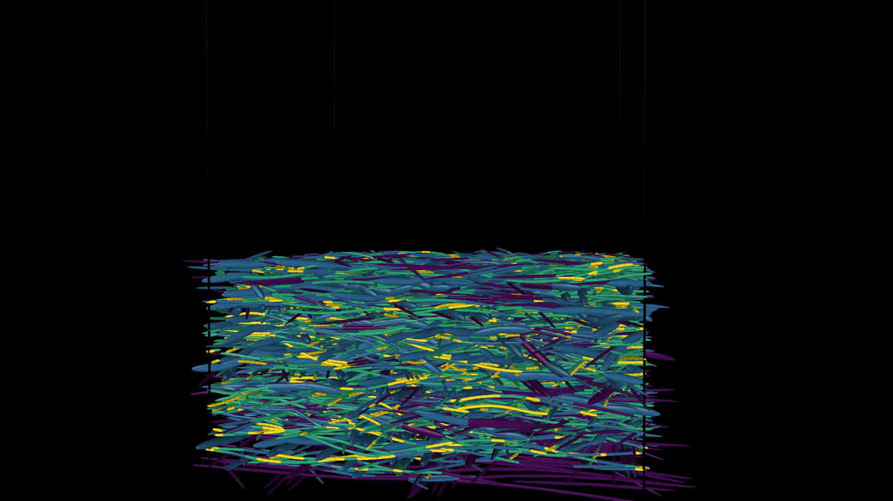
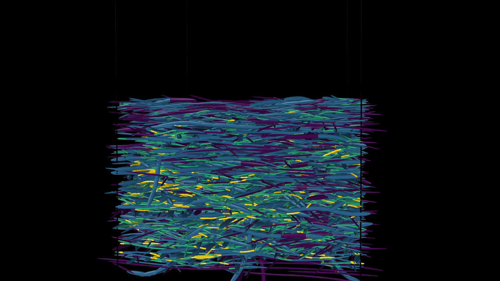
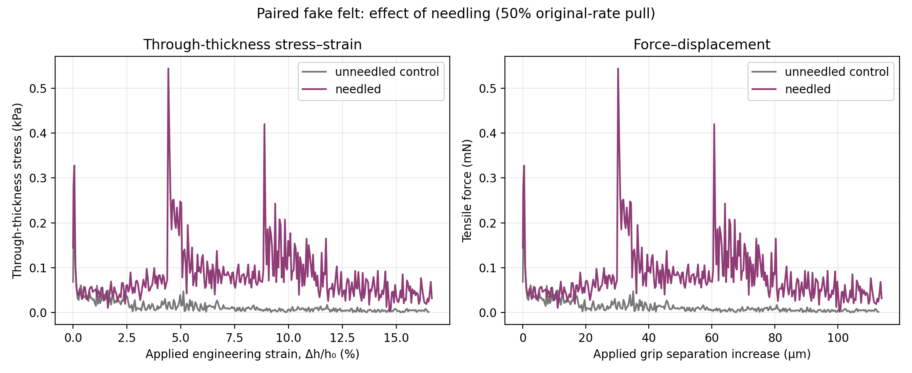
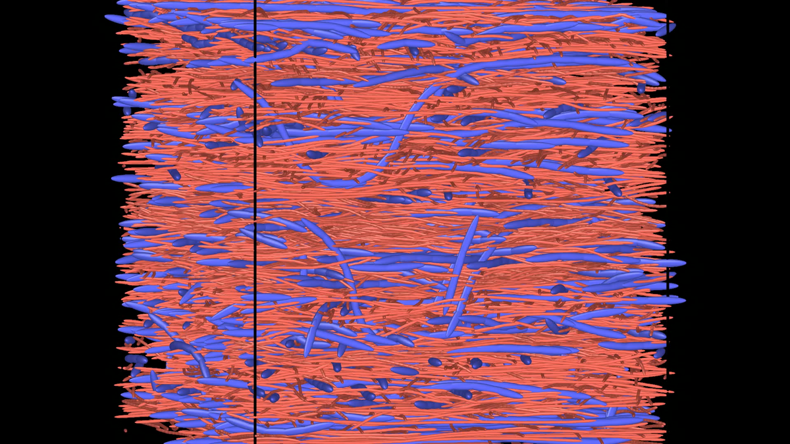
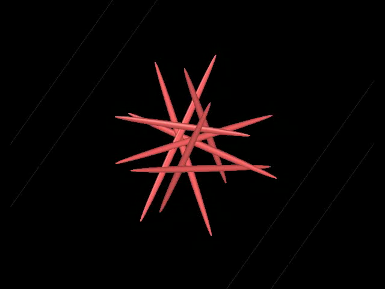
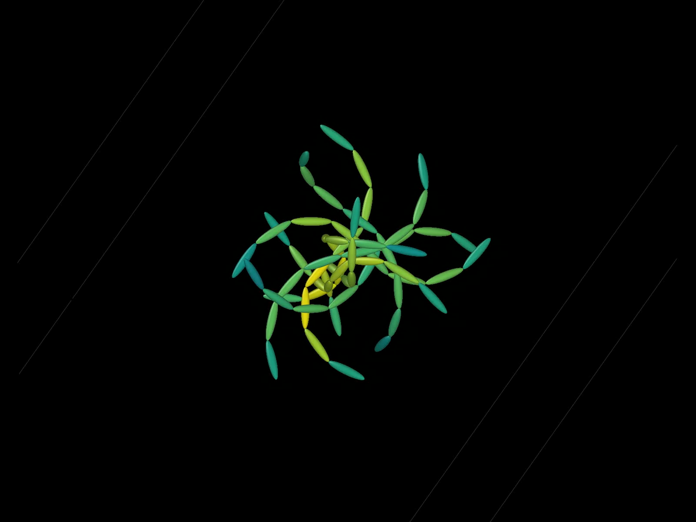

# TANGLE


**Thread Assembly, Network Generation, Linking, and Equilibration**

TANGLE is an experimental framework for generating and relaxing fibrous
materials. **Python is the primary user interface**: build fiber collections,
compose manufacturing recipes, inspect the result, and export to downstream
tools. Rust and CubeCL implement the geometry and numerical kernels underneath.
Its central object is a
`FiberAssembly`: intrinsic fiber centerlines, their placed geometry, persistent
junction topology, a simulation cell, and enough provenance to reproduce how
the assembly was made.

The same assembly supports solver-neutral BPM and voxel exports:

- particles, capsules, and bonds for DEM-BPM;
- swept-volume voxelizations for PuMA and image-based solvers;

Dedicated FEM mesh and graph-analysis exporters are future work.

Those representations are views or exports, not the canonical data model.

## Python quick start

Python is the simplest way to construct fiber collections and manufacturing
recipes. The `tangle` extension calls the same Rust data model and CubeCL
solver as the native applications; relaxation does not run as a Python loop.

Start with the [installation guide](crates/tangle_python/README.md) or
[tutorial 00](crates/tangle_python/python/tutorials/00_installation_and_environment.ipynb).
This is currently a **source install**, not a published-wheel installation.
You need Python 3.10+, Rust/Cargo, and a native compiler/linker. CubeCL downloads
its matching LLVM build dependency; a system `llvm-config` is not required.

After installing those prerequisites, from the repository root (macOS/Linux):

```console
python3 -m venv .venv-tangle
source .venv-tangle/bin/activate
python -m pip install "maturin>=1.8,<2" jupyterlab ipykernel
maturin develop --release --manifest-path crates/tangle_python/Cargo.toml
python -m ipykernel install --user --name tangle --display-name "Python (TANGLE)"
jupyter lab crates/tangle_python/python/tutorials
```

```python
import tangle
from tangle.units import mm, um

fiber = tangle.Material("fiber", diameter=19 * um)
layer = tangle.FiberCollection("first ply")
layer.add_fiber(
    [[-0.4 * mm, 0, 0], [0.4 * mm, 0, 0]],
    fiber,
    formation_layer=0,
)

# x and y are periodic, so z is the stacking axis.
cell = tangle.Cell([1 * mm, 1 * mm, 2 * mm], periodic="xy")
recipe = tangle.Recipe(cell)
recipe.insert(layer, translation=[0.5 * mm, 0.5 * mm, 0.5 * mm])
recipe.relax_until_converged()

settings = tangle.RelaxationSettings(
    penetration_tolerance=0.1 * um,
    adaptive_segmentation=tangle.AdaptiveSegmentationSettings(),
    # backend="cpu" on a system without a usable GPU.
)
result = recipe.run(settings)
print(result.converged, result.max_penetration, result.max_curvature_ratio)
analysis = result.characterize()
print(analysis.nominal_swept_volume_fraction)
```

Select the **Python (TANGLE)** notebook kernel. The installation guide includes
Windows and Miniforge alternatives. After rebuilding the extension, restart
the kernel before using new API arguments. Lengths are meters; `tangle.units`
provides `um` and `mm` multipliers, and TANGLE does not otherwise convert units.

All relaxation, cell-list, refinement, coarsening, compaction, checkpoint, and
recipe-stage controls are keyword arguments and inspectable Python attributes
with Rust-backed defaults. The [migration guide](docs/python_api_migration.md)
maps names from before the 0.1 API cleanup. Executable scripts and matching notebooks cover the
[small Python workflows](crates/tangle_python/python/examples) and
[the native Rust example configurations](crates/tangle_python/python/examples/native).
The [topic notebook series](crates/tangle_python/python/tutorials) treats one
piece of the API at a time and enumerates every exposed setting. See the
[Python guide](crates/tangle_python/README.md) for the complete API and
installation notes. Follow [01: high-level overview](crates/tangle_python/python/tutorials/01_high_level_overview.ipynb)
for staged insertion, relaxation, junction capture, and OVITO keyframes, then
use the [example index](examples/README.md) to choose a larger workflow.

TANGLE writes a versioned PuMA interoperability bundle through `export_puma()`:
`domain.vti` carries phase IDs and exact centerline tangents, while JSON files
preserve native characterization, material/fiber mappings, grid conventions,
and ambiguity diagnostics. The paired
[native fixture](examples/puma_cross_validation) and
[Python notebook](crates/tangle_python/python/examples/puma_cross_validation.ipynb)
build the same orthogonal-fiber fixture; the Python side imports `pumapy`
directly for comparison. See the
[interoperability specification](docs/puma_interoperability.md) for definitions
and resolution-study guidance. PuMA remains a downstream application, not a
TANGLE runtime dependency.

## Twenty-ply felt construction

The largest example builds otherwise matched control and needled specimens
from twenty planar plies. Click either OVITO preview to play the construction.

| Control | Needled |
| --- | --- |
| [](docs/media/felted-control.mp4) | [](docs/media/felted-needled.mp4) |

Both populations contain 7 and 19 micrometer fibers, split 50:50 by nominal
fiber volume rather than fiber count. The needled recipe deposits and relaxes
the plies in sequence, applies localized through-thickness pulls to the larger
fibers, releases those targets, and performs final contact and curvature
cleanup. Ordinary contacts are not converted into permanent junctions.

## Downstream mechanics in DIRT

TANGLE generates and relaxes the fiber geometry, then exports multi-material
spherocylinders and intra-fiber bonds for dynamic loading in
[DIRT](https://github.com/SueHeir/dirt). The interim result below compares
otherwise matched twenty-ply control and needled specimens in through-thickness
tension. DIRT grips the upper and lower 15% of each specimen; engineering strain
is referenced to the initial internal, non-gripped gauge length.



[](docs/media/dirt-needled-tension.mp4)

The movie shows the needled specimen during the same DIRT through-thickness
tension calculation. The two colors distinguish the 7 and 19 micrometer fiber
populations; click the preview to play it.

At approximately 16.6% strain, the needled specimen retains a larger,
intermittent load path while the unneedled control has fallen close to zero
stress. No bonds have broken at this point. This is a developing numerical
demonstration of the TANGLE-to-DIRT workflow, not a calibrated material
prediction. This figure is an archived interim snapshot, not a live indication
of simulation progress.

## Representative examples

The smaller examples isolate individual mechanics concepts. These two give a
compact progression from contact resolution to constrained deformation; the
[examples directory](examples) contains the complete set and per-example
settings.

| Concept | Demonstration |
| --- | --- |
| Contact separation | [](docs/media/center-point.mp4) |
| Rest shape and bend limits | [](docs/media/bend-limit.mp4) |

## What the solver does

Recipes approximate quasi-static manufacturing as explicit operations:
insert → relax → move/needle/compact → relax → capture junctions → export.
A recipe is not a time-accurate manufacturing simulation. Relaxation applies
iterative contact, stretch, rest-shape bending, and admissible-curvature
corrections; its iteration count is not physical time.

Rest centerlines define preferred lengths and bends. Placed centerlines are
the current geometry. A natural bend preference and a maximum permitted bend
are separate settings. Contacts are transient; captured junctions are persistent
topology for export, **not mechanically enforced bonds during relaxation**.
Usually capture them after the geometry has settled.

Check `result.converged`, residuals, warnings, and recipe events before using
an output as a relaxed specimen. A soft intermediate gate is not proof of final
hard admissibility. Exporting an assembly does not itself certify equilibrium.
See [solver and architecture notes](docs/architecture.md) for details.

## Outputs and analysis

- **OVITO:** final geometry or an opt-in multi-frame spherocylinder trajectory.
  Keyframes reduce snapshot traffic; dense debug output can dominate runtime.
- **BPM:** `spheres-exact`, `spheres-dynamic`, `spherocylinders-exact`, and
  `spherocylinders-constant`. TANGLE writes geometry and bonds, not DIRT runtime
  configuration files. Check downstream atom-style compatibility and overlap
  tolerances before running a dynamic solver.
- **Native analysis:** lengths, nominal volume fractions, per-material and
  per-fiber summaries, curvature, and length-/volume-weighted orientation.
- **Contacts and neighbors:** contact counts against a random-placement
  baseline, in-axis vs crossing contacts, contact persistence, and neighbor
  turnover along each fiber. Works on generated assemblies and on CT-tracked
  centerlines added with `Assembly.insert()`.
- **Fiber shape:** curvature and torsion distributions, tangent correlation and
  persistence length, curl index, and a Schladitz β orientation fit, from
  `characterize_shape()` on the same generated or CT-tracked centerlines.
- **Scorecard against a scan:** `tangle.score_structure(candidate, reference,
  contact_gap)` scores every shape, contact and orientation metric by its
  distance to the reference divided by the reference's own
  subvolume-to-subvolume spread.
- **PuMA:** circular-capsule VTI/JSON bundles for direct `pumapy` analysis.
  Occupied voxel volume and nominal fiber volume are different quantities;
  comparisons need matched definitions and resolution checks.

[Results/export tutorial](crates/tangle_python/python/tutorials/14_results_and_exports.ipynb)
· [PuMA analysis guide](docs/puma_interoperability.md)

## Backends and reproducibility

WGPU is the default; CPU execution is explicitly selected with
`settings.backend = "cpu"`. Both use CubeCL kernels, with no silent CPU
fallback. Large manufacturing recipes are intended for accelerators.

Seeded generation is deterministic. GPU/CPU relaxation is not guaranteed
bitwise identical across runs or devices; assess reproducibility using explicit
geometric and residual tolerances. Save the recipe, settings, code revision,
and backend with your results.

Checkpoints preserve partial recipe and device state, but this experimental
project does **not** guarantee restart compatibility across revisions. Keep the
generating commit and an independent geometry export. Output folders, local
environments, and notebooks' generated results are excluded from Git.

## Rust and development

Rust is the implementation and plugin-extension path, not a prerequisite for
writing Python recipes once the extension is installed.
See [architecture](docs/architecture.md), [native examples](examples/README.md),
and the [Python guide](crates/tangle_python/README.md).

```console
cargo fmt --all -- --check
cargo check --workspace --all-targets
cargo test --workspace
python -m unittest discover -s crates/tangle_python/python/tests -v
```

Device tests need a supported runtime. For CPU-only relaxation tests:

```console
cargo test -p tangle_relax --no-default-features --features cpu --lib -- --test-threads=1
```
