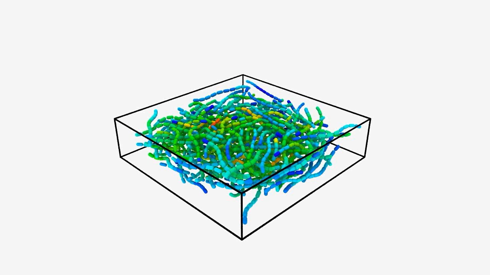

# TANGLE

[](https://github.com/SueHeir/tangle/actions/workflows/ci.yml)

**Thread Assembly, Network Generation, Linking, and Equilibration**

TANGLE is an experimental, solver-neutral representation and generation
framework for fibrous material assemblies. Its central object is a
`FiberAssembly`: intrinsic fiber centerlines, their placed geometry, persistent
junction topology, a simulation cell, and enough provenance to reproduce how
the assembly was made.

The same assembly is intended to support several derived representations:

- beam-element meshes for FEM;
- particles, capsules, and bonds for DEM-BPM;
- swept-volume voxelizations for PuMA and image-based solvers;
- graph views for connectivity and transport analysis.

Those representations are views or exports, not the canonical data model.

## Example progression

The examples build from one deliberately impossible contact to staged material
formation. Click any preview to play the short OVITO rendering.

| Stage | Demonstration |
| --- | --- |
| 1. Rigid separation | [](docs/media/center-point.mp4) |
| 2. Rest curvature | [](docs/media/rest-curvature.mp4) |
| 3. Admissible bend limit | [](docs/media/bend-limit.mp4) |
| 4. Biased planar population | [](docs/media/planar-bias.mp4) |
| 5. Manufacturing recipe | [](docs/media/formation-recipe.mp4) |
| 6. Layer-by-layer needling | [](docs/media/layered-needling.mp4) |
| 7. Twenty-ply control | [](docs/media/felted-control.mp4) |
| 8. Twenty-ply needled material | [](docs/media/felted-needled.mp4) |

## Current scope

The first implementation contains `tangle_core`, which establishes:

- stable fiber, material, section, junction, and junction-law identifiers;
- intrinsic, placed, and optional assembled-reference centerlines;
- material-coordinate `FiberAnchor`s that survive centerline remeshing;
- two-or-more-anchor persistent junctions;
- structural and geometric validation;
- resolution of an anchor onto the current piecewise-linear discretization.

The `tangle_app` crate adds a GRASS workflow contract for ordering generation,
contact detection, iterative relaxation, junction formation, deformation, and
export. It does not implement those scientific algorithms; replaceable plugins
will supply them.

The first real pipelines are split across focused crates:

- `tangle_generate` creates deterministic straight and multi-segment crossing
  fibers with independent intrinsic and initially placed shapes;
- `tangle_contact` owns device-resident uniform-grid broad phase and capsule
  contact kernels;
- `tangle_characterize` measures swept-volume fraction and the length-weighted
  second-order orientation tensor before and after relaxation;
- `tangle_relax` owns the persistent device world, CubeCL runtime selection,
  and rigid or flexible centerline mechanics;
- `tangle_checkpoint` provides versioned, atomic restart files for long
  device-resident formation runs;
- `tangle_export` discretizes relaxed centerlines as a bonded-sphere model.

## Run the examples

TANGLE requires a Rust toolchain and a CubeCL/WGPU-compatible device. GRASS is
resolved from its tagged Git repository, so a sibling checkout is not required.

```console
cargo run -p tangle_core --example crossed_fibers
cargo run -p fibers_through_center_point_dem_bpm
cargo run -p fibers_through_center_point_dem_bpm -- --debug-ovito
cargo run -p multisegment_flexible_relaxation_dem_bpm
cargo run -p multisegment_flexible_relaxation_dem_bpm -- --debug-ovito
cargo run --release -p biased_fiber_box_dem_bpm
cargo run --release -p biased_fiber_box_dem_bpm -- --debug-ovito
cargo run --release -p fake_tps_formation -- --debug-ovito
cargo run --release -p fake_needled -- --debug-ovito
cargo run --release -p fake_needled_2 -- --checkpoint
cargo run --release -p fake_needled_2 -- --resume
cargo run --release -p biased_fiber_box_dem_bpm --bin biased_fiber_stress -- \
  --case planar_layered --fiber-count 800
cargo test --workspace
```

The `--debug-ovito` option records relaxation as a multi-frame LAMMPS dump of
oriented spherocylinders and writes an OVITO Python viewing recipe beside it.
The multi-segment example compares straight/straight, straight/curved, and
curved/curved shape semantics with free endpoints, plus an intentionally
over-bent placement. A per-fiber minimum bend radius prevents geometric
relaxation from creating nonphysical kinks, and OVITO colors each capsule by
its fraction of the admissible curvature. The example captures each converged
geometry as the optional assembled reference before producing its DEM-BPM
model.

CubeCL is the first-class execution path rather than a separate feature crate.
Contact code lives in `tangle_contact`, relaxation code in `tangle_relax`,
formation schedules in `tangle_generate`, and device snapshot export in
`tangle_export`. All physical examples pack topology, intrinsic constraint
data, and placed geometry
into flat buffers and uploads them into a persistent `DeviceFiberWorld`.
GRASS controls bounded GPU relaxation batches and can insert formation plugins
between them without downloading geometry. Each correction pass rebuilds a
compact count/scan/scatter cell list on the device, then runs exact capsule contacts, Jacobi
vertex corrections, stretch constraints, rest-chord bending constraints, and
a pinned-aware three-point admissible-curvature projection. A state is accepted
as converged only when capsule penetration and maximum bend ratio both satisfy
their configured hard tolerances. Formation recipes may add bounded
`RelaxUntilConverged` gates between manufacturing commands; a failed gate
terminates the recipe explicitly instead of exporting an inadmissible state.
The motion model can instead apply one translation per fiber when exact rigid
centerline preservation is required.
Orthorhombic periodic axes use wrapped cell-list neighborhoods and minimum-image
capsule contacts; bounded axes retain hard planar walls.
Normal batches download only scalar status; final positions are downloaded for
export. `--debug-ovito` explicitly requests sparse geometry snapshots. The
current WGPU backend uses Metal on supported Apple systems.

Seeded generation is deterministic. Relaxation is reproducible to configured
physical tolerances, but is not promised to be bitwise identical: parallel
atomic insertion may visit same-cell candidates in a different order, and
floating-point accumulation can differ across runs, devices, and backends.
Tests and restart acceptance should therefore compare residuals and geometry
with explicit tolerances rather than byte-for-byte output.

Optional adaptive centerlines reserve dyadic segment trees once, then alter
only device-resident activity masks. Refinement requires persistent unresolved
contact instead of reacting to one overlap sample. Contact-free collinear
siblings can coarsen after a separate cooldown; pinned, actively targeted,
significantly bent, and junction-bearing topology is retained. Both clocks use
lifetime solver iterations and are independent of GRASS batch boundaries.

Long runs can opt into sparse restart checkpoints without adding readback to
ordinary batches. A checkpoint atomically captures the assembly, formation
recipe cursor and partial operation, relaxation counters, exact device
positions and active topology, adaptive refinement/coarsening history, cell bounds, and
active layer or needle targets. Scratch contact buffers are rebuilt after
resume. The `fake_needled_2` example exposes this as `--checkpoint` and
`--resume`; its rolling file is written under the example's `output` folder.

The planar population installs a separate `LayeredFormationPlugin`. Generated
fibers retain explicit manufacturing-layer labels; the plugin first relaxes at
the generated spacing, sends small target-plane commands between GPU batches,
compacts the layers incrementally, stops issuing layer targets, and then allows
the ordinary relaxation plugin to complete. Alternative manufacturing plugins
can operate on the same resident world and workflow-control resource.

The `fake_tps_formation` example makes that modularity explicit. It preallocates
planar and through-thickness populations, then executes an editable recipe of
`ActivateFibersThrough`, `RelaxFor`, `MoveLayers`, and closed-loop `Compact`
operations. Fiber geometry stays resident while the sequence performs insert →
relax → compact → relax → insert → relax. Its OVITO trajectory omits dormant
preallocated fibers, so the through-thickness insertion is visible as a
topology change.

The `fake_needled` example uses a layer-staged population and repeats deposit →
place → relax → needle → relax. Before each needle pull it releases the
layer-center tethers, so prescribed top-layer vertices transmit motion through
ordinary contacts into a mechanically free stack. After six layers it lowers
the top platen to a 40% nominal volume-fraction target.

`Compact` changes the resident cell in small logarithmic-strain increments,
relaxes after every increment, and stops on nominal volume fraction, cell
volume or lengths, directional pressure, mean pressure, or formation penalty
energy. Prescribed axis ratios, equal-pressure control, stress-ratio control,
and minimum-incremental-work selection share the same controller. Fibers may
follow the cell by rigid center translation, affine vertex deformation, or
moving hard walls. Step size grows after inexpensive convergence and shrinks
after difficult relaxation; penetration, admissible curvature, pressure,
energy, step-count, and jamming guards produce explicit reports. The large
topology and geometry buffers remain resident while only small status and
pressure/energy summaries are read at controller checkpoints.
Each compaction increment is transactional: the controller snapshots the last
accepted device state, rolls back a failed trial exactly, reduces the strain
step, and retries. A rejected penetrated state is therefore never accumulated
into later compaction.

Formation recipes can also use `CaptureJunctions` at explicit process points or
`RelaxAndCapture` at an iteration cadence independent of GRASS batch size. A
junction policy filters GPU-captured contact candidates by material pair,
surface gap, crossing angle, deterministic probability, multiplicity, and
material-coordinate spacing, then assigns a symbolic junction law and parameter
set. Persistent junctions export as inter-fiber DEM-BPM bonds; ordinary contacts
remain transient and are not stored as junctions.
