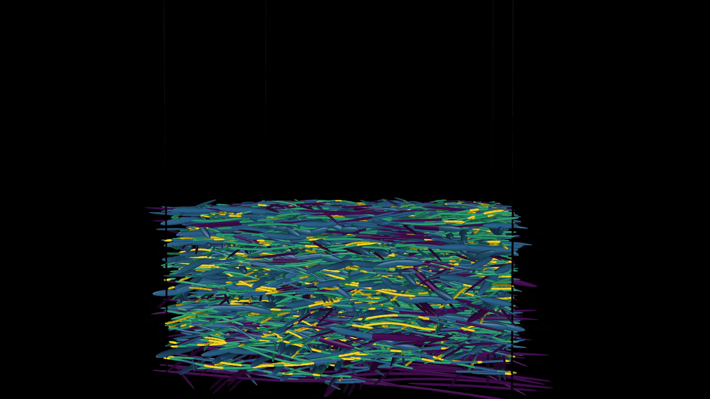
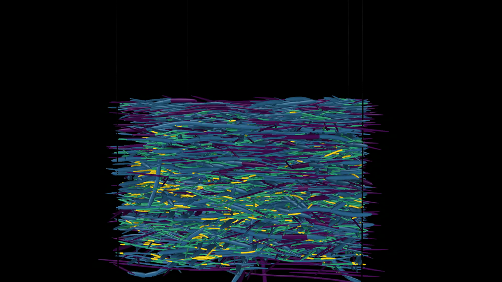
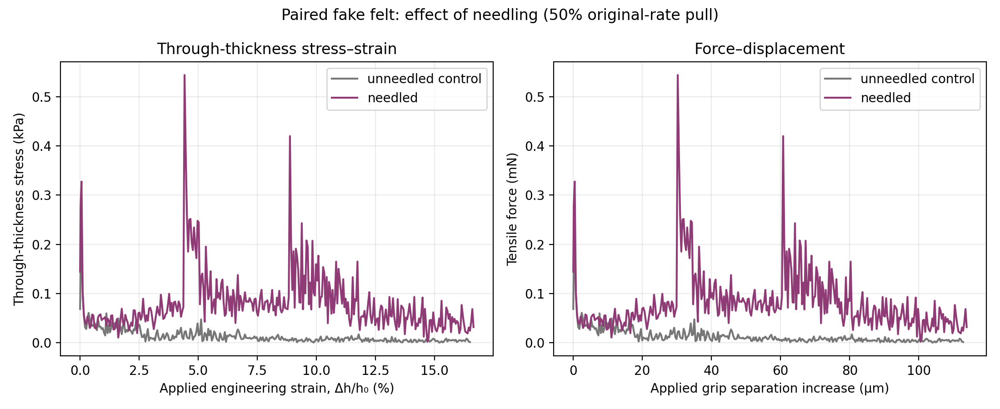
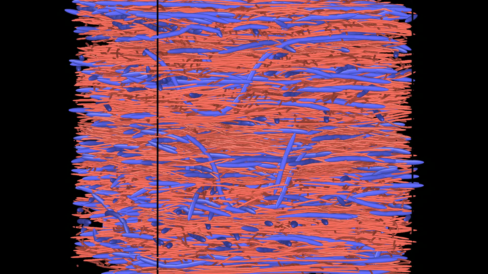
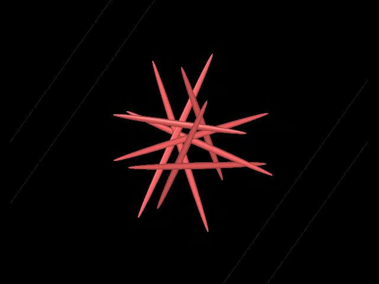
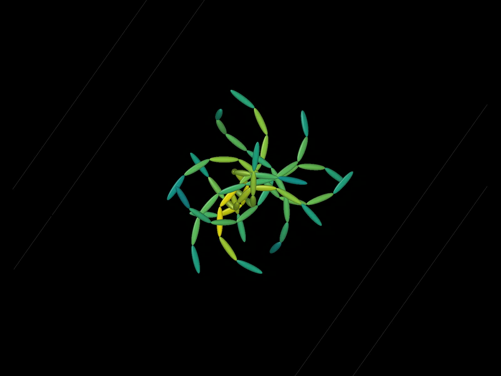
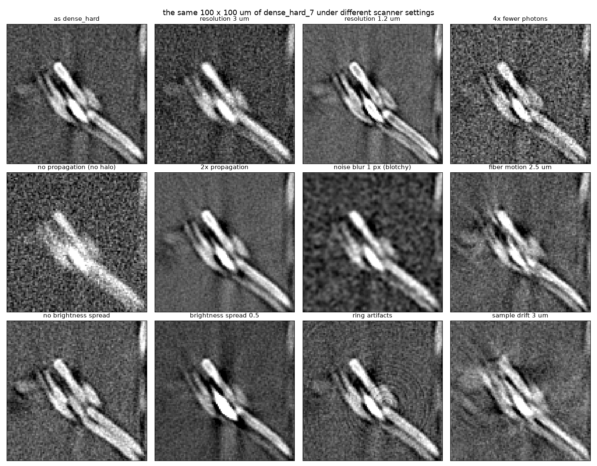

# TANGLE


**Thread Assembly, Network Generation, Linking, and Equilibration**

TANGLE builds and relaxes virtual fibrous materials (felts, preforms,
nonwovens) and fits fibers to CT scans. You use it from **Python**; the
geometry and solver run in Rust on the GPU (through CubeCL and WGPU, the
cross-platform GPU API) or on the CPU.

It exports the relaxed fibers to OVITO for viewing, to bonded-particle
models for discrete-element (DEM) mechanics, and to voxel images for PuMA and
other image-based solvers.

## Quick start

TANGLE installs from source. You need Python 3.11+ and
[Rust](https://rustup.rs/). From the repository root (macOS or Linux):

```console
python3 -m venv .venv-tangle
source .venv-tangle/bin/activate
python -m pip install "maturin>=1.8,<2"
maturin develop --release --extras ct --manifest-path crates/tangle_python/Cargo.toml
```

`--extras ct` adds NumPy and SciPy for CT fitting (`tangle.ct`). Then:

```python
import tangle
from tangle.units import um

cell = tangle.Cell([300 * um] * 3, periodic="xyz")
fiber = tangle.Material("fiber", diameter=10 * um)

recipe = tangle.Recipe(cell)
recipe.insert(tangle.FiberPopulation(material=fiber, count=40))
result = recipe.run()  # relaxes until no two fibers overlap (GPU)

print(result)
result.write_ovito("fibers.dump")
```

Lengths are in meters (`um` and `mm` help). Settings you leave unset scale
with the fiber diameter. Without a GPU, use
`recipe.run(tangle.RelaxationSettings(backend="cpu"))`.

**Next steps**

1. The [Python guide](crates/tangle_python/README.md): installation on Windows
   or Conda, a quick start that also fits a CT scan, and the full API.
2. [Tutorial 01](crates/tangle_python/python/tutorials/01_high_level_overview.ipynb)
   and the [topic notebooks](crates/tangle_python/python/tutorials): one piece
   of the API at a time, every setting listed.
3. The [example index](examples/README.md): larger workflows, from two crossed
   fibers to a twenty-ply needled felt.

Upgrading from before the 0.1 API cleanup? See the
[migration guide](docs/python_api_migration.md).

## Twenty-ply felt construction

The largest example builds otherwise matched control and needled specimens
from twenty planar plies. Click either OVITO preview to play the construction.

| Control | Needled |
| --- | --- |
| [](docs/media/felted-control.mp4) | [](docs/media/felted-needled.mp4) |

Both populations contain 7 and 19 micrometer fibers, split 50:50 by nominal
fiber volume rather than fiber count. The needled recipe deposits and relaxes
the plies in sequence, applies localized through-thickness pulls to the larger
fibers, releases those targets, and performs final contact and curvature
cleanup. Ordinary contacts are not converted into permanent junctions.

## Downstream mechanics in DIRT

TANGLE generates and relaxes the fiber geometry, then exports multi-material
spherocylinders and intra-fiber bonds for dynamic loading in
[DIRT](https://github.com/SueHeir/dirt). The interim result below compares
otherwise matched twenty-ply control and needled specimens in through-thickness
tension. DIRT grips the upper and lower 15% of each specimen; engineering strain
is referenced to the initial internal, non-gripped gauge length.



[](docs/media/dirt-needled-tension.mp4)

The movie shows the needled specimen during the same DIRT through-thickness
tension calculation. The two colors distinguish the 7 and 19 micrometer fiber
populations; click the preview to play it.

At approximately 16.6% strain, the needled specimen retains a larger,
intermittent load path while the unneedled control has fallen close to zero
stress. No bonds have broken at this point. This is a developing numerical
demonstration of the TANGLE-to-DIRT workflow, not a calibrated material
prediction. This figure is an archived interim snapshot, not a live indication
of simulation progress.

## Representative examples

The smaller examples isolate individual mechanics concepts. These two give a
compact progression from contact resolution to constrained deformation; the
[examples directory](examples) contains the complete set and per-example
settings.

| Concept | Demonstration |
| --- | --- |
| Contact separation | [](docs/media/center-point.mp4) |
| Rest shape and bend limits | [](docs/media/bend-limit.mp4) |

## What the solver does

Recipes approximate quasi-static manufacturing as explicit operations:
insert → relax → move/needle/compact → relax → capture junctions → export.
A recipe is not a time-accurate manufacturing simulation. Relaxation applies
iterative contact, stretch, rest-shape bending, and admissible-curvature
corrections; its iteration count is not physical time.

Rest centerlines define preferred lengths and bends. Placed centerlines are
the current geometry. A natural bend preference and a maximum permitted bend
are separate settings. Contacts are transient; captured junctions are persistent
topology for export, **not mechanically enforced bonds during relaxation**.
Usually capture them after the geometry has settled.

Check `result.converged`, residuals, warnings, and recipe events before using
an output as a relaxed specimen. A soft intermediate gate is not proof of final
hard admissibility. Exporting an assembly does not itself certify equilibrium.
See [solver and architecture notes](docs/architecture.md) for details.

## Outputs and analysis

- **OVITO:** final geometry or an opt-in multi-frame spherocylinder trajectory.
  Keyframes reduce snapshot traffic; dense debug output can dominate runtime.
- **BPM (bonded-particle model, for DEM):** `spheres-exact`, `spheres-dynamic`, `spherocylinders-exact`, and
  `spherocylinders-constant`. TANGLE writes geometry and bonds, not DIRT runtime
  configuration files. Check downstream atom-style compatibility and overlap
  tolerances before running a dynamic solver.
- **Native analysis:** lengths, nominal volume fractions, per-material and
  per-fiber summaries, curvature, and length-/volume-weighted orientation.
- **Contacts and neighbors:** contact counts against a random-placement
  baseline, in-axis vs crossing contacts, contact persistence, and neighbor
  turnover along each fiber. Works on generated assemblies and on CT-tracked
  centerlines added with `Assembly.insert()`.
- **Fiber shape:** curvature and torsion distributions, tangent correlation and
  persistence length, curl index, and a Schladitz β orientation fit, from
  `characterize_shape()` on the same generated or CT-tracked centerlines.
- **Oval fibers:** `Material(..., thickness=...)` gives fibers an oval
  cross-section that relaxes, twists and exports to OVITO and PuMA; see the
  [oval fiber notes](docs/oval_fibers.md). BPM export is round-only.
- **PuMA:** `export_puma()` writes a VTI/JSON bundle (phase ids, fiber
  tangents, characterization) for direct `pumapy` analysis; PuMA is not a
  TANGLE dependency. Occupied voxel volume and nominal fiber volume are
  different quantities; comparisons need matched definitions and resolution
  checks (see the [PuMA analysis guide](docs/puma_interoperability.md)).
- **CT scans:** `tangle.ct` fits Tangle fibers to a CT scan from the known
  fiber diameter and bend limit, and exports an assembly, a fitted
  population, per-voxel fiber labels and a per-fiber overlay on the scan.
  See the [CT fitting guide](docs/ct_fitting.md), the
  [step-by-step method](docs/ct_fitting_internals.md), the
  [simulated CT scanner](docs/ct_scanner.md), the
  [dense_hard benchmark](docs/ct_dense_hard.md), and the
  [results on synthetic scans, with pictures](crates/tangle_python/python/examples/ct_results/README.md).
- **Synthetic CT scans:** `ct.synthetic_ct` with `ct.Scanner` scans any Tangle
  structure the way a micro-CT does (projections, phase-contrast
  propagation, detector blur, photon noise, filtered back-projection), with
  the true fibers known. See [synthetic CT, step by step](docs/ct_synthetic.md).

  
- **CT map network:** a 3D U-Net trained on Tangle's own simulated scans turns
  a scan into maps (each voxel's offset to its fiber's axis, the fiber
  direction and diameter, binder), and a short tracer reads the fibers off
  them; types are assigned per fiber, so any number of fiber types works, and
  the known fiber sizes and whether the sample is bonded can be given as hints.
  On the simulated `dense_hard` sets it traces 99.5% centerline F1, against
  91.5% for the grey fitter, and whole scans run in overlapping tiles. See the
  [CT map network guide](docs/ct_unet.md).

  

[Results/export tutorial](crates/tangle_python/python/tutorials/14_results_and_exports.ipynb)
· [PuMA analysis guide](docs/puma_interoperability.md)
· [Fiber bonds (binder at junctions)](docs/fiber_bonds.md)
· [CT fitting guide](docs/ct_fitting.md)
· [CT fitting results](crates/tangle_python/python/examples/ct_results/README.md)
· [Synthetic CT scans](docs/ct_synthetic.md)
· [CT map network](docs/ct_unet.md)

## Backends and reproducibility

WGPU is the default; CPU execution is explicitly selected with
`settings.backend = "cpu"`. Both use CubeCL kernels, with no silent CPU
fallback. Large manufacturing recipes are intended for accelerators.

Seeded generation is deterministic. GPU/CPU relaxation is not guaranteed
bitwise identical across runs or devices; assess reproducibility using explicit
geometric and residual tolerances. Save the recipe, settings, code revision,
and backend with your results.

Checkpoints preserve partial recipe and device state, but this experimental
project does **not** guarantee restart compatibility across revisions. Keep the
generating commit and an independent geometry export. Output folders, local
environments, and notebooks' generated results are excluded from Git.

## Rust and development

Rust is the implementation and plugin-extension path, not a prerequisite for
writing Python recipes once the extension is installed.
See [architecture](docs/architecture.md), [native examples](examples/README.md),
and the [Python guide](crates/tangle_python/README.md).

```console
cargo fmt --all -- --check
cargo check --workspace --all-targets
cargo test --workspace
python -m unittest discover -s crates/tangle_python/python/tests -v
```

Device tests need a supported runtime. For CPU-only relaxation tests:

```console
cargo test -p tangle_relax --no-default-features --features cpu --lib -- --test-threads=1
```
