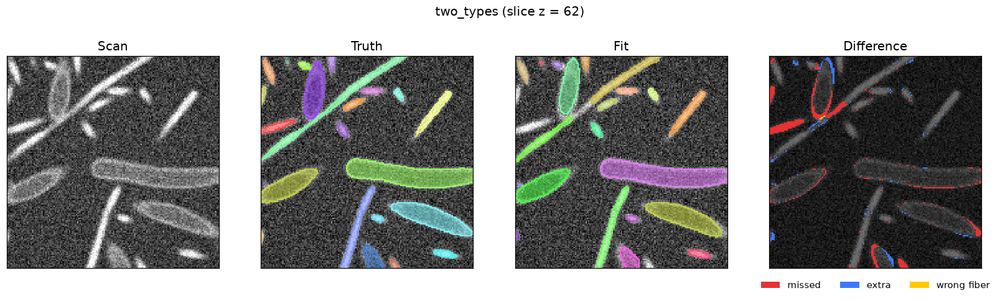
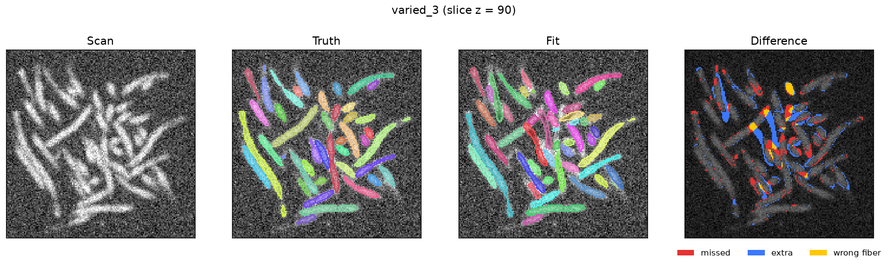
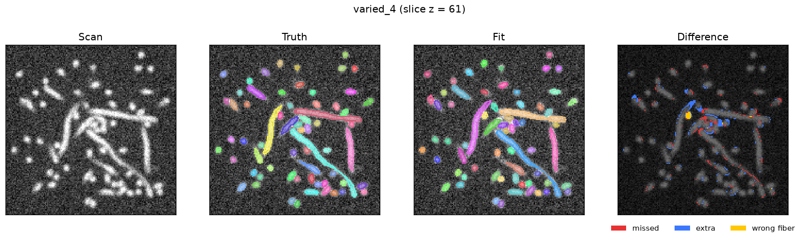
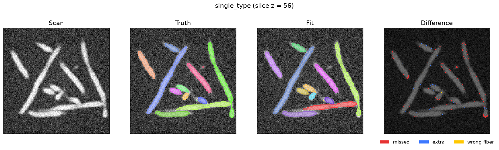
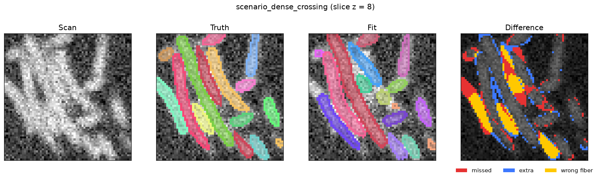
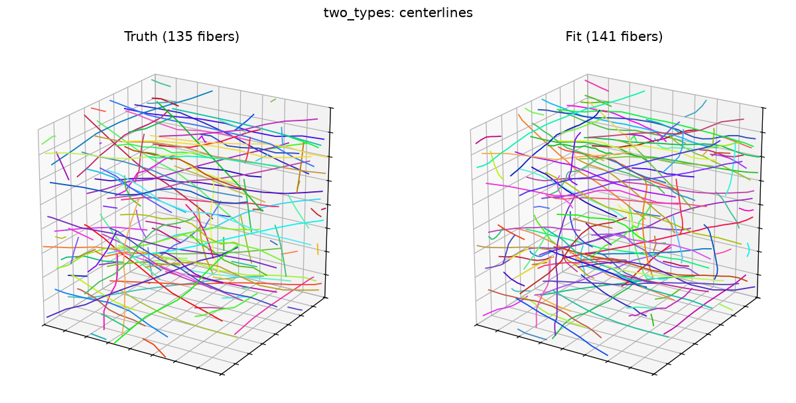
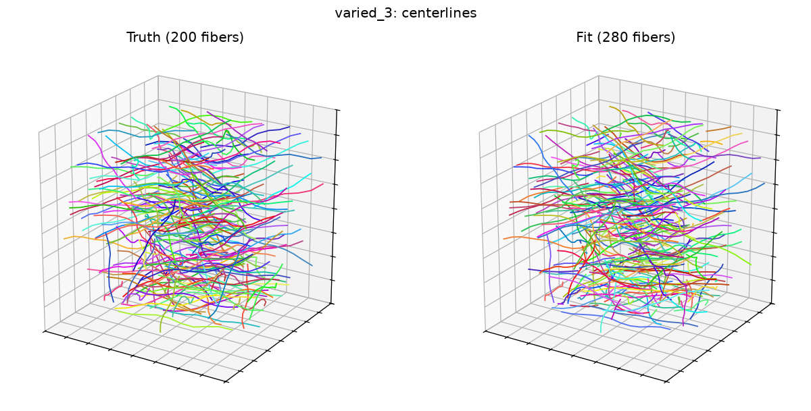
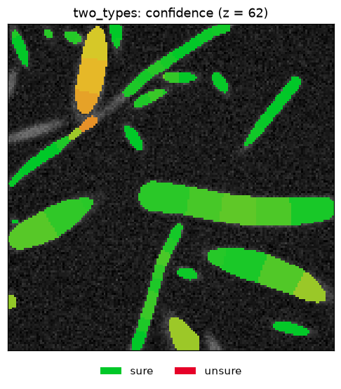
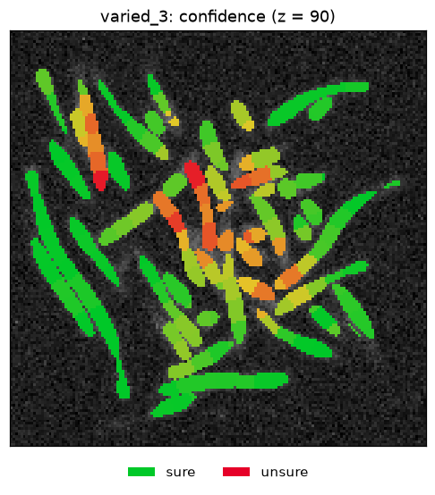

# CT fitting results

The results of a full run of [`ct_examples.py`](../ct_examples.py): every
`tangle.ct` example, fitted on the GPU (Apple M5 Pro, Metal).

## The idea

A CT scan of a fibrous material is a 3D grey image. What we want from it is
not the image but the **fibers**: where each individual fiber runs, so the
structure can be measured, compared with generated structures, or loaded
into Tangle and simulated.

Ordinary segmentation thresholds the scan and splits the result into
blobs, which fails wherever fibers touch or cross. `tangle.ct` uses what we
already know about the material instead. We tell it the fiber diameters, how
tightly the fibers can bend, and how each fiber type looks in the scan (its
grey profile from axis to surface). It then places **Tangle fibers** in the
scan and moves them with Tangle's own GPU solver until they match the grey.
Every fiber stays a round tube that doesn't overlap its neighbors and never
bends past its limit, so the answer is always a physically possible
structure.

The fit works in four stages:

1. **Trace.** Fibers are traced from the thickest parts of the fiber image,
   following the local tube direction, with turns limited by the bend radius.
2. **Solve.** The traced fibers are pulled toward the scan by an image force
   in the solver, while contact and bending constraints hold.
3. **Check the ends.** After every solve, any fit that has drifted off its
   fiber into empty space is trimmed or split. A fit that only bowed off its
   fiber and came back is bridged instead.
4. **Redraw what's unsure.** Every stretch of every fiber gets a confidence
   score from the scan alone. Unsure stretches are cut out and redrawn,
   trying every way of connecting or ending the loose ends. A redraw is kept
   region by region only if the fit matches the scan's grey better.

The details are in [`docs/ct_fitting.md`](../../../../../docs/ct_fitting.md)
and [`docs/ct_fitting_internals.md`](../../../../../docs/ct_fitting_internals.md).

## How we test it

We can't measure accuracy on a real scan, because nobody knows the true
fibers. So every test here is a **synthetic scan of a Tangle structure**:

1. **Build** a fiber structure with Tangle (relaxed, so fibers touch and
   cross as they do in real material).
2. **Render** it as a CT scan with `ct.synthetic_ct`: grey profiles per
   fiber type, blur (point spread), noise and a slow intensity drift. The
   true fibers are kept as ground truth.
3. **Fit** the scan with `ct.fit_fibers`, knowing only what we would know
   for a real scan: the voxel size, and each type's diameter, bend limit and
   grey profile.
4. **Score** the fit against the truth with `ct.score`.

To avoid tuning the fitter to one structure, there are three kinds of
tests:

- **Main examples:** `single_type`, `long_fibers` (fibers longer than the
  scan) and `two_types` (7 µm and 19 µm fibers at 1.25 µm voxels, like a
  real scan).
- **Scenarios:** small scenes, one per situation the fitter has to handle:
  a gap, a crossing, touching fibers, a tight bend. Also bundles cut out of
  earlier failures (`missed_fiber`, `dense_crossing`).
- **Varied structures:** `varied_1` to `varied_8`, drawn from seeds with
  different orientations (planar, aligned, cross-ply, isotropic), fiber
  sizes, densities, waviness, noise and blur. They check that fixes
  generalize.

### What the scores mean

- **Recovered:** one fitted fiber follows at least 80% of the true fiber.
  **Split:** it takes several fits. **Missed:** it isn't followed.
  **False:** a fit mostly in empty space. **Merged:** a fit that follows
  two true fibers.
- **Centerline recall / precision / F1:** the share of every true
  centerline that its own fitted fiber traces within half a radius, and the
  share of fitted centerline lying on the fiber it belongs to. This is
  the score that matters: it ignores how the tube edges fill voxels, and a
  fit that jumps to a neighboring fiber loses the length after the jump.
- **Label accuracy:** the share of true fiber voxels given to the right
  fiber. It is strict at fiber edges, so a near-perfect fit scores about
  0.95.

## Results

Centerline F1 is the headline number: 1.0 means every true fiber is traced
end to end by exactly one fit.

### Main examples

| Example | What it is | Recovered | Centerline F1 | Label accuracy | Time |
| --- | --- | --- | --- | --- | --- |
| `single_type` | 40 wavy 12 µm fibers | 40/40 | **0.999** | 0.949 | 10 s |
| `long_fibers` | fibers longer than the scan, crossing its edges | 61/61 | **0.987** | 0.926 | 16 s |
| `two_types` | 7 µm and 19 µm fibers at 1.25 µm voxels (the 7 µm ones are under 3 voxels in radius) | 96/116 | **0.886** | 0.881 | 52 s |

### Varied structures

| Example | Orientation | Fibers | Diameter (radius in voxels) | Solid fraction | Recovered | Centerline F1 | Time |
| --- | --- | --- | --- | --- | --- | --- | --- |
| `varied_1` | planar | 105 | 16 µm (2.5) | 0.05 | 96/105 | **0.982** | 21 s |
| `varied_2` | aligned | 117 | 14 µm (3.2) | 0.07 | 110/117 | **0.966** | 29 s |
| `varied_3` | cross-ply | 200 | 10 µm (3.0) | 0.12 | 128/200 | **0.863** | 104 s |
| `varied_4` | isotropic, very wavy | 152 | 14 µm (2.8) | 0.07 | 123/152 | **0.942** | 42 s |
| `varied_5` | planar | 91 | 12 µm (4.4) | 0.12 | 91/91 | **0.996** | 27 s |
| `varied_6` | aligned | 146 | 12 µm (3.7) | 0.12 | 123/146 | **0.937** | 48 s |
| `varied_7` | cross-ply | 97 | 8 µm (4.1) | 0.10 | 97/97 | **0.994** | 24 s |
| `varied_8` | isotropic | 81 | 10 µm (4.1) | 0.09 | 81/81 | **0.994** | 17 s |

Each is a 160-voxel cube with its own noise, blur, waviness and bend limit
(recorded in its `score.json`). Where fibers are at least about 4 voxels in
radius, every fiber is recovered. The hard case is thin fibers (about 3
voxels in radius) packed densely, as in `varied_3` and the fine fibers of
`two_types`. There, most errors are fibers split in two or a fit that
jumps to a touching neighbor.

### Scenarios

| Scenario | What it checks | Recovered | Centerline F1 |
| --- | --- | --- | --- |
| `single_straight` | one straight fiber | 1/1 | 0.995 |
| `interior_ends` | a fiber that ends inside the scan | 1/1 | 1.000 |
| `gap_2r` | two pieces 2 radii apart | 1/2 | 0.492 |
| `gap_6r`, `gap_12r` | two pieces 6 and 12 radii apart | 2/2, 2/2 | 1.000, 0.994 |
| `crossing_90`, `crossing_30` | two fibers crossing | 2/2, 2/2 | 0.995, 1.000 |
| `parallel_touching` | two fibers side by side | 2/2 | 1.000 |
| `bent_near_limit` | a fiber bent close to its limit | 1/1 | 1.000 |
| `missed_fiber` | a 12-fiber bundle an early version split | 11/12 | 0.997 |
| `dense_crossing` | the worst 64-voxel cube of `varied_3`: 55 thin fibers | 34/55 | 0.810 |
| `short_piece` | a piece shorter than the minimum length | none expected | – |

`gap_2r` is by design: a gap of two radii looks the same as a dim spot on
one fiber, so the fitter joins the pieces.

The full table, with splits, misses, false and merged fits and centerline
recall and precision, is in [`summary.md`](summary.md). The truth
structures are relaxed once and cached, so a rerun on the same machine
reproduces these numbers exactly.

## What the fits look like

Each row is one slice through the scan: the rendered scan, the true
fibers, the fit, and where the two differ (red: missed, blue: fit where there
is no fiber, orange: fiber given to the wrong fiber).

**two_types**: 7 µm and 19 µm fibers (the 19 µm ones have a bright rim
and a dim core).

**varied_3**: the densest structure, thin fibers in crossed layers.

**varied_4**: fibers in every direction, very wavy.

**single_type** and **dense_crossing**:

### The fitted fibers in 3D

The true centerlines (left) and the fitted ones (right), one color per
fiber.

### The fit's own confidence

On a real scan there is no truth to compare with, so the fitter scores
itself from the scan alone. Green is sure, red is unsure. The red areas
mostly line up with the errors in the difference images above (each
`score.json` records how well), so on a real scan they show where to
look.

## Files

Each example folder holds `score.json` (every score, the settings, the run
time) and `fit.json` (the fit; reload it with `ct.load_fit`).
`summary.md` has one row per example. The TIFF stacks (`raw`, `true`,
`segment`, `diff`, `confidence`) are kept for `two_types` and `varied_3`
only; rerun `python ct_examples.py <example>` to regenerate the others.
`make_images.py` redraws the pictures in `images/`.
