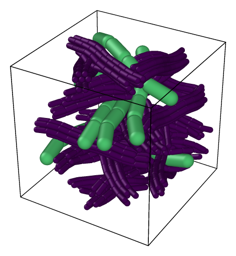
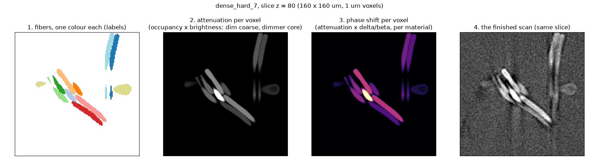
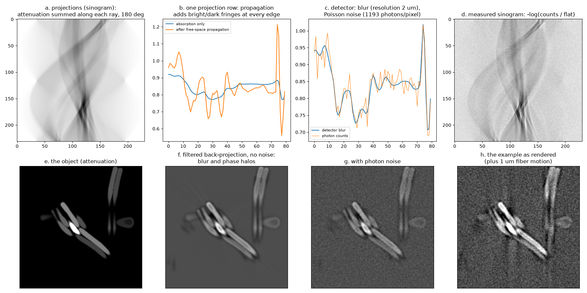
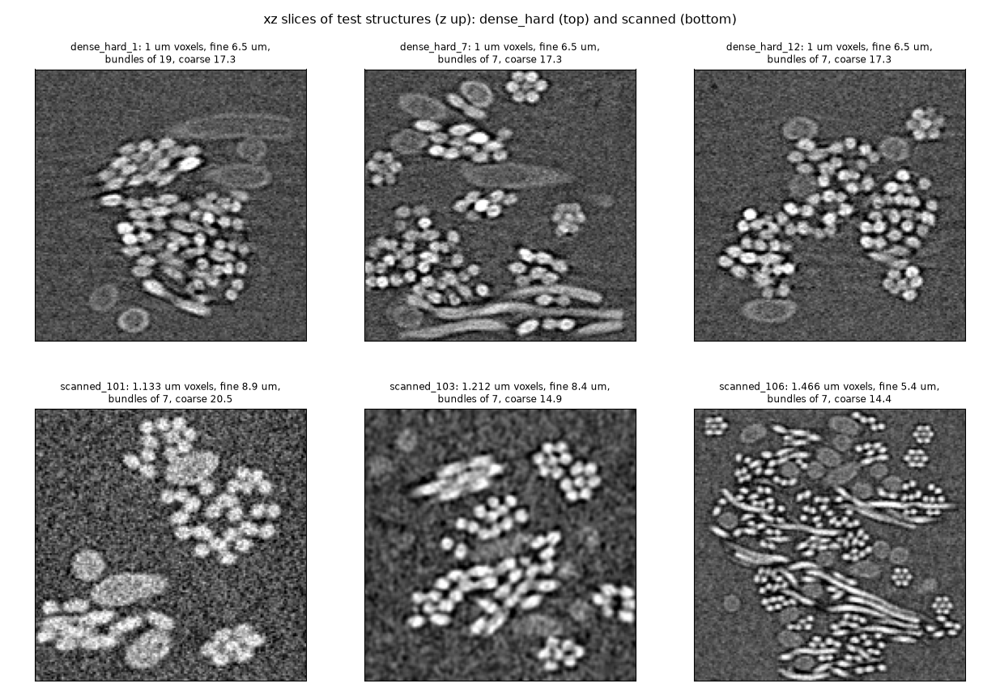

# Synthetic CT scans, step by step

Tangle can make CT scans of structures it built, so every fiber in the scan is
known exactly. That is how the CT fitters are tested (a fit is scored against
the true centerlines) and how the [CT map network](ct_unet.md) is trained.
This page shows the whole process in pictures, on one of the test structures,
`dense_hard_7`. The settings are explained in full in
[ct_scanner.md](ct_scanner.md) and the test set in
[ct_dense_hard.md](ct_dense_hard.md); the pictures are made by
[`examples/ct_synthetic/make_figures.py`](../crates/tangle_python/python/examples/ct_synthetic/make_figures.py).

```
Tangle geometry  ->  the object (labels, attenuation, phase)  ->  the acquisition  ->  a scan + its truth
 (relaxed fibers)      what the x-rays pass through              projections, noise,     volume, labels,
                                                                  reconstruction          centerlines, types
```

## 1. The geometry: a Tangle structure



*`dense_hard_7`: 160 µm box, fine fibers of 6.5 µm packed in bundles of seven
(purple) and flat oval coarse fibers of 17.3 × 13.8 µm (green).*

A structure starts as fiber populations (`tangle.FiberPopulation`: count,
length range, curvature, orientation, position), here planar with a small
tilt. For bundles, one leader fiber per bundle is drawn and its members are
packed hexagonally around it, a hair apart, with staggered ends. Tangle then
relaxes everything together until no two fibers overlap and none bends past
its limit (5 diameters here), and the result is cached, so the same
structure comes back every time (`ct_examples.relaxed_truth`).

## 2. The object: what the x-rays pass through



Tangle's exporter voxelizes the fibers: which fiber owns each voxel (the
**labels**, panel 1, the truth a fit is scored against) and how much of each
voxel a fiber fills (partial volume at the surfaces). `synthetic_ct` turns
that into the **attenuation** of every voxel (panel 2), fiber type by fiber
type (`ct.CrossSection`): the fine fibers solid at brightness 1, the coarse
ones dimmer (0.6) with a still dimmer core inside a 3 µm rim, and every fiber
scaled by its own random factor (`brightness_spread`, here log-normal with
σ = 0.25), so no single grey level separates the types. The **phase shift**
(panel 3) is the attenuation times each material's δ/β ratio: it is what
gives phase-contrast halos in the acquisition. Panel 4 is the same slice of
the finished scan.

## 3. The acquisition



`ct.Scanner` then does what a parallel-beam micro-CT does, slice by slice
([`_scanner.py`](../crates/tangle_python/python/tangle/ct/_scanner.py)):

- **a. Projections.** The attenuation is summed along x-ray paths at as many
  angles over 180° as the detector is wide; one row of each projection per
  slice makes the sinogram.
- **b. Propagation.** Each projection is the exit wave of a weak phase and
  absorption object; it travels a short distance (the Fresnel number) to the
  detector. That makes the bright and dark fringes at every edge, which the
  reconstruction turns into dark halos just outside the fibers, darkest in
  the gap between touching fibers.
- **c. The detector.** Its blur (the scanner's resolution, 2 µm FWHM here),
  then photon counting: Poisson noise from the photons per pixel (about 1200
  here). Optional: a blur after counting (`noise_blur`, as a scintillator
  spreads each photon's light, which makes the noise blotchy), a per-column
  gain error (rings), and motion of each fiber or the whole sample during
  the scan.
- **d. The measured sinogram:** minus the log of the counts over the flat
  field.
- **e.-h.** Filtered back-projection (a Shepp-Logan ramp filter) gives the
  reconstructed slice: without noise (f) the blur and halos alone, with noise
  (g), and the example as it is rendered, with each fiber also moving about
  1 µm during the scan (h).

Because the blur, the noise texture and the halos come out of these steps
together, their relations (how noise and blur trade off, how the halo sits
at the surface) are the ones a real acquisition has, not three effects added
independently.

## 4. Scanner settings


The same 100 × 100 µm under different settings (each still has everything
else of the example; see [ct_scanner.md](ct_scanner.md#settings) for all of
them):

| setting | what it does in the picture |
|---|---|
| `resolution` | the blur: 3 µm merges touching fibers, 1.2 µm separates them |
| `photons` | noise: 4x fewer photons doubles the noise |
| `propagation`, `delta_beta` | the phase-contrast halos; with none the fibers are only faintly brighter than the void, with twice as much the halos dominate |
| `noise_blur` | blotchy (correlated) noise, as many real reconstructions have |
| `fiber_motion`, `drift` | fibers or the whole sample moving during the scan: doubled or smeared edges |
| `brightness_spread` | fiber-to-fiber brightness: 0 makes each type one grey level, 0.5 makes some fibers nearly vanish |
| `ring_strength` | detector gain errors, which reconstruct as rings about the rotation axis |

## 5. What you get, and the test sets



`ct.synthetic_ct` returns a `SyntheticScan`: the scan (`volume`, uint16,
z y x), the true `labels`, `centerlines` (voxel units, at the fibers' rest
positions), `radii`, `types`, and for oval fibers their `semi_axes` and
`long_axes`. `ct.score(fit, scan)` compares any fit with it.

Two families of test structures are built this way in
[`ct_examples.py`](../crates/tangle_python/python/examples/ct_examples.py):

- **`dense_hard_1`-`36`** (top row): 1 µm voxels, fine fibers in bundles of
  7 or 19, flat oval dim-cored coarse fibers, halos, brightness spread.
  1-18 are used for tuning, 19-36 only to check.
- **`scanned_*`** (bottom row): drawn from ranges of voxel size (1-1.5 µm),
  fiber sizes, orientation (planar, aligned, layered), bundle size, blur,
  noise, noise blur and motion, for variety.

The [CT map network](ct_unet.md) is trained on more structures made the same
way, at indices past these, so the test structures are never seen in
training.

## Making one

```python
import ct_examples as ex                       # crates/tangle_python/python/examples
example = ex.EXAMPLES["dense_hard_7"](Path("cache/dense_hard_7.json"))
scan = example.scan                            # the SyntheticScan
```

or build any structure and scan it directly, as in the example at the top of
[ct_scanner.md](ct_scanner.md). To redo the pictures on this page:

```sh
python examples/ct_synthetic/make_figures.py CACHE_DIR docs/media --ovito PYTHON_WITH_OVITO
```
