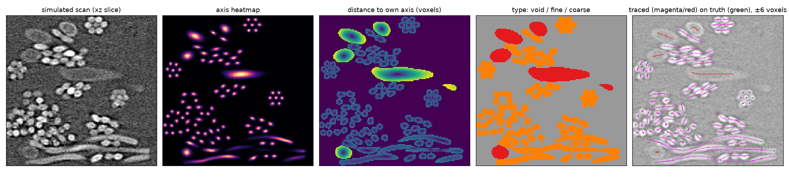

# CT map network: fibers from a 3D U-Net

`tangle.ct` fits fibers to the grey scan directly. This is a second route: a
3D U-Net, trained on Tangle's own simulated scans, turns the scan into maps that
make fibers easy to follow, and a short tracer reads the fibers off the maps.
The traced centerlines can then go through one Tangle solve (contacts, bend
limits, known fiber sizes) like any fit.

The code is in
[`crates/tangle_python/python/examples/ct_unet/`](../crates/tangle_python/python/examples/ct_unet/).
It needs PyTorch (Apple GPU, CUDA or CPU), NumPy, SciPy and, for the figure,
matplotlib.



*A slice of `dense_hard_7` (never seen in training). From left: the simulated
scan; the axis heatmap; each fiber voxel's distance to its own axis; the
predicted fiber diameter; the traced centerlines, typed per fiber (magenta
fine, red coarse), over the true ones.*

## Results on the simulated sets

Centerline F1 (`ct.score`'s centerline agreement: the share of the true axes
traced within half a radius, and of the traced axes lying on their own fiber):

| set | grey fitter (best settings) | map network + tracer |
|---|---|---|
| `dense_hard_1`-`18` (the tuning set) | 0.915 | **0.995** |
| `dense_hard_19`-`36` (fresh structures) | 0.911 | **0.995** |
| `scanned_101`-`108` (other voxel sizes, blur, orientations) | | **0.974** |

The network scans a 160³ volume in about a second and the tracer takes a few
seconds on the CPU. On `scanned_101`-`108` the weakest case (0.88) is a scan
whose fine fibers are under 4 voxels across.

**The general network** (any number of fiber types, any sizes; the table above
is the first, two-type network). It knows nothing about types: it finds fibers
and their diameters, and types are assigned per fiber afterwards. On a held-out
set of 24 `varied` scans (1-4 fiber types of 3.5-28 voxels, mixed bundles,
planar to fully 3D) it scores **0.84** on the scans whose thinnest fibers are
resolvable, given the fiber sizes, and types **94%** of the traced length right;
on `dense_hard` and `scanned` it keeps 0.99 and 0.98. Told whether a scan is
bonded, it finds binder bonds with an F1 of 0.42 (validation) and 0.27 (test),
and none in bond-free scans; on perfect maps the same bond finder reaches
0.72-0.98, so the network, not the finder, is the limit there (thin menisci
under the blur are the hardest shape).

## What the network predicts

For every voxel, 14 numbers:

1. **Axis heatmap:** a peak on every fiber centerline, exp(-d²/2s²) with d the
   distance to the nearest axis and s = max(1, 0.3 r). It is kept sharp on
   purpose: the score only counts a point within half a radius of the axis,
   1.6 voxels for a 6.5-voxel fiber.
2. **Offset to the axis** (3): the vector from the voxel to its own fiber's
   centerline. Two touching fibers push their voxels in opposite directions,
   so the boundary between them is explicit even where the grey shows no gap.
3. **Direction** (6): the fiber's tangent as the sign-free tensor t tᵀ, so a
   fiber pointing +x and one pointing -x read the same.
4. **Fiber:** fiber or void.
5. **Radius:** the radius of the voxel's own fiber (predicted as its log).
6. **Binder:** binder or not (bridges, menisci, blobs and coatings).
7. **Bond points:** a small peak (1.5 voxels) at the center of every bond.

There is no type output: types are decided per fiber after tracing (below), so
one network handles any number of fiber types.

**Hints.** The network can be told what is known about the sample, through a
small code that scales and shifts the features after every block (FiLM; it
starts as a no-op, so a trained network can be extended with it). Every hint
is optional: the fiber types' diameters (any number as a soft histogram of
their logs, and up to four one by one, each with its section shape and whether
it is hollow, if known), whether there is binder (and the bond size relative to
the fibers), and whether the sample has short broken fiber pieces, dust or
voids (`maps.size_code`). Training crops get a random part of what is true
about their scan, about a third of them nothing at all (sizes jittered by
±10%), so one network works with any hints or none (`maps.draw_hints`).
Networks trained before the type, broken-piece, dust and void hints read only
the first part of the code (sizes and binder) and work exactly as before.

The network is a plain 3D U-Net: four 2x poolings (128³ down to 8³), two
3x3x3 convolutions with group norm per level, skip connections, and a 1x1 head.
The current one is 24 channels wide at the top (384 at the bottom), widened
from a trained 16-wide one with `train.py --widen` (Net2Net: the wider copy
starts with exactly the same maps). Training crops are 128³; any volume whose
sides are divisible by 16 can be predicted in one go, and bigger ones in tiles.

## The tracer

[`trace_maps.py`](../crates/tangle_python/python/examples/ct_unet/trace_maps.py):

1. **Votes:** every voxel the network calls fiber votes for its axis at voxel +
   offset. Votes are pooled in 1-voxel cells; a cell with enough votes is an
   axis point, carrying the mean position, the principal direction and the
   mean radius.
2. **Tracking:** from the best-supported unused axis point, a track steps 1.5
   voxels at a time both ways along the direction, moving to the mean of the
   axis points ahead whose direction agrees (so a crossing fiber's points are
   ignored), coasting over short gaps and stopping where it runs onto a fiber
   already traced. A track uses up the points within max(1.2, r/2) of it, r
   its own predicted radius.
3. **Tidy** (optional, `tidy_up`): traces lying on top of a longer one for over
   half their length are dropped, and traces whose ends face each other across
   a short straight gap are joined. This barely changes F1 but brings the
   number of traces close to the number of fibers, which matters for a solve
   afterwards.

**Types** ([`fiber_types.py`](../crates/tangle_python/python/examples/ct_unet/fiber_types.py)):
each traced fiber's median diameter (and median axis grey) is known. With the
fiber sizes known, each fiber gets the type whose diameter is nearest
(`assign_by_size`); otherwise a Gaussian mixture on diameter and grey, with the
number of types given or picked by BIC (`assign_types`).

**Bonds** ([`bonds.py`](../crates/tangle_python/python/examples/ct_unet/bonds.py)):
every bond-point peak, and every group of binder voxels, is given to the two
traced fibers whose surfaces are nearest it; the two lists are merged. Binder
touching one fiber only (a coating) is no bond.

Whole scans are traced from overlapping tiles (`tiled_axis_points`: 128³ tiles
every 64 voxels). Each voxel votes from the tile whose center it is nearest, so
it always has at least 32 voxels of context around it, the votes of all tiles
pool into one set of axis points, and the fibers are tracked once over the
whole volume, with no seams to stitch.

## Training data

[`make_data.py`](../crates/tangle_python/python/examples/ct_unet/make_data.py)
renders Tangle structures with the synthetic scanner
([ct_synthetic.md](ct_synthetic.md)), at indices well past the test sets, so
`dense_hard_1`-`36` and `scanned_101`-`108` are never seen. Each file stores the
scan, the labels and, per voxel, the nearest true axis point, so the targets
are cheap gathers at load time. The sets:

- **`dense_hard` and `scanned`** (~600 volumes of 160³): packed bundles, flat
  oval coarse fibers, halos, per-fiber brightness; voxel size, blur,
  orientation and fiber sizes varied.
- **`varied`** (`--varied`, ~400): 1-4 fiber types of 3.5-28 voxels at least
  30% apart in size, each with its own cross-section, brightness and bundling,
  orientations from planar to fully 3D.
- **focused** (indices from 4001, ~800): weighted toward what the first round
  found hard: the thinnest fibers, bundles, 3D orientations; the blur never
  exceeds the thinnest fiber, so every scan is resolvable.
- **bonds** (from 5001, ~750): 65% of the scans have binder at fiber junctions
  (Tangle's junction capture, bond size 0.3-1.5 fiber radii); from 7001 the
  binder takes several shapes (bridge, meniscus, blob) and some fibers carry a
  binder coating that bonds nothing.
- **`mixed`** (`--mixed`, from 100001; validation 99001-99032, test
  99501-99548): every kind of variety at random inside each scan
  ([`mixed.py`](../crates/tangle_python/python/examples/ct_unet/mixed.py)).
  Fibers straight, gently bent, tightly curled or crimped (a wave or a zigzag,
  flat or helical), some with loops or hairpins; single, in bundles, in twisted
  yarn-like bundles or in touching pairs; round, oval or hollow, with a spread
  of diameters or thinning along their length. Binder bonds, webs and blobs
  (some with air bubbles), dust (a few grains dense enough to streak), short
  broken fiber pieces and voids; cut faces with air beyond them and the edge
  of the field of view; nearly empty to dense. The scanner's flaws too: rings,
  streaks, beam-hardening cupping, slice-to-slice drift, phase halos, resin
  embedding. Every structure passes the overlap check, fibers against each
  other and against themselves (loops, hairpins, coils).

[`train.py`](../crates/tangle_python/python/examples/ct_unet/train.py): 128³
random crops (several data folders at once, a folder named twice counts twice),
xy swaps and flips in x, y and z (the fibers mostly lie in planes, so no
general rotations), grey-level jitter, AdamW with a one-cycle schedule, batch 1
(12,000 steps is about 5.5 hours on an Apple M5 Pro GPU). `--init` starts from
a trained network (outputs it lacks start near zero), `--widen` widens it, and
`--condition` adds the hints.

**Correlated noise.** CT reconstructions often have noise correlated over about
a voxel, so the void looks blotchy; the simulated scans mostly have near-white
noise. A network trained only on those calls blotches the size of a coarse
fiber "coarse fiber". `--noise 0.25` adds a noise field blurred by 0.6-1.3
voxels to 70% of the crops; fine-tuning the trained network 4,000 steps with it
(`--init`) removes these false fibers, at no cost on the simulated sets.

## Fiber diameters along each fiber (optional)

[`diameters.py`](../crates/tangle_python/python/examples/ct_unet/diameters.py)
measures the diameter at every 1-voxel node of a traced (or solved) fiber: each
fiber voxel is counted for the node its axis vote lands on, so touching fibers
keep their own voxels. Area per unit length gives the equal-area diameter; the
spread of those voxels across the axis gives the long and short widths of an
oval and its long-axis direction. On the simulated sets
([`check_diameters.py`](../crates/tangle_python/python/examples/ct_unet/check_diameters.py))
it reads about 0.4 voxel high for fibers from 5 to 20 voxels across, and the
along-fiber spread of a truly constant fiber reads about 0.3-0.6 voxel (fine)
and 1.2-1.9 voxels (coarse): the floor below which a change along a fiber is
noise. The output adds a diameter per node, so it is off by default and meant
for measurement, not for simulation input.

## Running it

From `crates/tangle_python/python/examples/ct_unet/`, with `tangle` importable:

```sh
python make_data.py DATA 1001 400                      # training scans (indices past the test sets)
python make_data.py VARIED 4001 800 --varied           # varied fiber types and sizes (focused round)
python make_data.py VAL 5000 16                        # validation scans
python train.py DATA,VARIED VAL RUN --steps 12000 --condition           # train (Apple GPU if present)
python train.py DATA,VARIED VAL RUN2 --steps 4000 --lr 1e-3 --noise 0.25 --init RUN/best.pt
python score_trace.py RUN2/best.pt CACHE dense_hard_1 dense_hard_2      # centerline F1 against the truth
python score_trace.py RUN2/best.pt - VARIED_TEST/*.npz --known-sizes    # ... with the sizes as a hint
python check_diameters.py RUN2/best.pt CACHE dense_hard_7               # diameters against the truth
python make_figure.py RUN2/best.pt CACHE ct-unet-maps.png
```

`CACHE` is a folder of `ct_examples` truth caches (as `ct_examples.py --output`
writes them); use the same caches as the grey-fitter runs you compare with, so
the scans are identical. In Python, for your own scan:

```python
from maps import levels, load, predict
from trace_maps import tiled_axis_points, track, tidy_up
from fiber_types import assign_by_size

model = load("best.pt", "mps")                  # any saved network
sizes = [6.5, 15.0]                             # known fiber diameters (voxels), or None
grey = levels(volume[::4, ::4, ::4])            # one grey scaling for the whole scan
points = tiled_axis_points(
    lambda z, y, x: predict(model, volume[z:z+128, y:y+128, x:x+128], "mps", grey, diameters=sizes, bonds=False),
    volume.shape)
lines, radii = track(*points, shape=volume.shape, min_length=3 * min(sizes))
lines, radii = tidy_up(lines, radii)
types = assign_by_size(radii, sizes)
```

## Limits

- Trained and tested on one simulator. On a scan whose noise, contrast or fiber
  sizes lie outside the training range, check the traces by eye before
  trusting them, and add training data that covers it.
- The tracer's output is centerlines, radii and a type, not a finished Tangle
  assembly: run a Tangle solve on them for contacts and bend limits.
- The grey-level check some pipelines apply after tracing (drop traces no
  brighter than the void) is a safety net, not part of the method.
