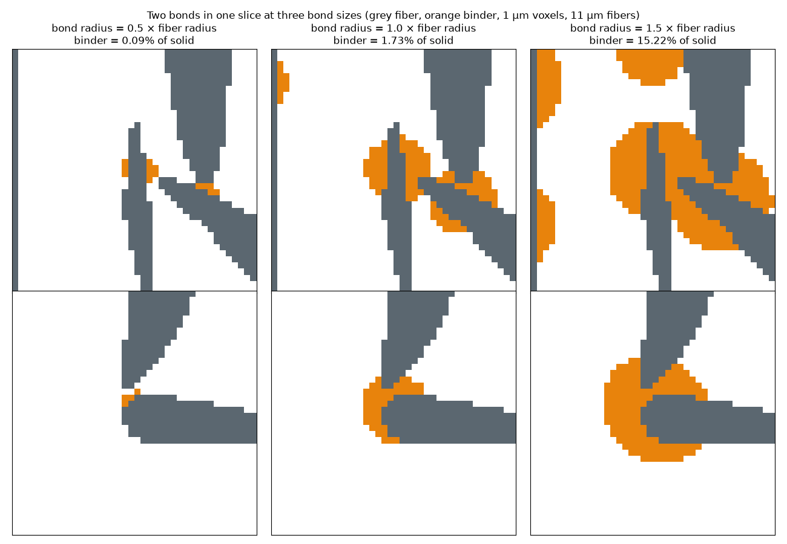

# Fiber bonds (binder at junctions)

Rigid fibrous thermal protection materials are held together by a binder at
the places where fibers cross. Tangle already captures those places as
persistent **junctions** (`JunctionPolicy`, `capture_junctions`,
`relax_and_capture`). This page explains how the OVITO and PuMA exports draw a
junction as a binder **bond**, and what the public literature says about
where real bonds form.

## What is known about bonds in bonded TPS fiber materials

- **FiberForm** (rayon-based carbon fiber, the substrate of PICA) is made from
  a slurry of chopped carbon fibers, phenolic resin and water. The slurry is
  vacuum cast, compressed, cured and then carbonized, so only a thin carbon
  binder phase is left
  ([NASA 20190000972](https://ntrs.nasa.gov/api/citations/20190000972/downloads/20190000972.pdf)).
  The binder is uneven. Some crossings have very little binder, while
  elsewhere small groups of fibers are bound together. Under tension, fibers
  pull out where the binder is thin
  ([NASA 20110015019](https://ntrs.nasa.gov/api/citations/20110015019/downloads/20110015019.pdf)).
  The binder oxidizes faster than the fibers, and losing it can collapse the
  network with no surface recession
  ([Ringel et al. 2025](https://pmc.ncbi.nlm.nih.gov/articles/PMC12548517/)).
  FiberForm fibers are about 10–12 µm in diameter and lie mostly in-plane, in
  layers 150–300 µm thick. The density is 0.17–0.18 g/cm³, with about 10 %
  fiber by volume and 85–89 % porosity
  ([arXiv 2110.04244](https://arxiv.org/pdf/2110.04244),
  [NASA 20190000972](https://ntrs.nasa.gov/api/citations/20190000972/downloads/20190000972.pdf)).
- **Carbon-bonded carbon fiber** (CBCF) uses the same recipe. The green body
  is 54 wt % carbonized rayon fiber (about 10 µm diameter, 250 µm long) and
  46 wt % phenolic, carbonized at 1600 °C
  ([OSTI 5567894](https://www.osti.gov/biblio/5567894)). The binder carbon is
  described as collecting mostly at fiber intersections, as bridges, with
  some coating along the fibers
  ([PMC10052708](https://pmc.ncbi.nlm.nih.gov/articles/PMC10052708/)).
- **Silica and alumina tiles** (LI-900, FRCI, AETB) have no resin. During
  firing, borate or colloidal-silica glass collects at the fiber junctions and
  fuses the fibers together
  ([US6716782B2](https://patents.google.com/patent/US6716782B2/en),
  [US4148962A](https://patents.google.com/patent/US4148962A/en)).

Several things are not published: the size of a bond relative to the fiber
diameter, its exact shape, the fraction of crossings that are bonded, and
FiberForm's binder fraction. PuMA's fiber generators have no binder option,
and the micro-CT studies of FiberForm segment fiber and binder as one solid.
Tangle therefore leaves these quantities to the recipe:

- **Which crossings are bonded:** the `JunctionPolicy` filters, including
  `max_surface_gap`, the crossing angles, `material_pairs`, and
  `probability`, the fraction of eligible contacts that bond.
- **Bond size:** `bond_radius_ratio` on the export.

## The bond shape

Each junction's binder is a **bridge**: a round capsule from the anchored
point on one fiber's centerline to the anchored point on the other. Its
radius is `bond_radius_ratio` times the thinner fiber's radius, using the
short semi-axis for an oval fiber. Most of the bridge lies inside the two
fibers. The part outside them is a neck around the contact, which is where
the binder collects at a crossing. A junction with more than two anchors gets
one bridge from its first anchor to each of the others. In a periodic cell,
the second anchor is taken at its nearest image, so a junction across a cell
wall gives a short bridge.

`tangle_export::junction_bridges(assembly, radius_ratio)` returns these
bridges, and both exporters use it, so the two outputs always agree.

### Bond size

The binder a bridge adds depends strongly on its radius. The table below
comes from
[`bonded_fibers.py`](../crates/tangle_python/python/examples/bonded_fibers.py),
a felt of 11 µm fibers with 214 bonds, voxelized at 1 µm. It gives the binder
as a share of all solid voxels at each ratio:

| `bond_radius_ratio` | Binder share of the solid |
| --- | --- |
| 0.5 | 0.09 % |
| 1.0 (default) | 1.7 % |
| 1.5 | 15 % |

- **At 0.5:** the neck is under a voxel thick.
- **At 1.0:** each crossing gets a fillet a few voxels thick.
- **At 1.5:** the bridge swells past the fibers into a node.

A bridge is a lower bound on the binder in a real bonded felt. It fills the
crotch of a crossing, but not a meniscus that climbs along the fibers, a
coating along them, or clumps that bind several fibers. The ORNL CBCF recipe
(46 wt % phenolic in the green body) suggests the binder carbon could be tens
of percent of the solid, assuming a char yield of roughly 50–60 %. That is
an estimate, not a published measurement.

## OVITO

`result.write_ovito(path, bond_radius_ratio=1.0)` and the debug trajectories
draw each bridge as one extra spherocylinder row. That row has:

- **Particle type:** `atom_type + 2`, which follows the fiber type and the
  connected view's vertex-sphere type.
- **`mol` column:** 0.
- **`junction` column:** the junction's ID. Fiber rows have 0 here.

The generated viewing script colors bonds grey. Pass
`bond_radius_ratio=None` to leave bonds out. The DEM-particle representation
does not draw them.

## PuMA

`export_puma(..., bond_radius_ratio=1.0)` adds binder to the bundle. Bonds
are off by default (`None`), and without them every image is byte-for-byte
the same as for the same fibers without junctions. With bonds on:

- **`domain.vti`:** binder voxels get their own `phase_id`, one past the last
  material. The manifest's `binder.phase_id` records it. Their
  `orientation` is the bridge axis. A voxel whose center lies inside both a
  fiber and a bridge stays fiber.
- **`bond_ids.vti`** (UInt32 `bond_id`): the owner junction of each binder
  voxel, one-based in junction-table order. The manifest's `binder.bonds`
  maps it to the junction ID, the law name, and the bridge radius and length.
- **`binder_interface.vti`** (UInt8 `binder_grayscale`): the bridge's smooth
  occupancy, capped so that it plus `interface_grayscale` never exceeds 255.
  A CT forward model can then give binder its own attenuation:
  `fiber_occupancy × μ_fiber + binder_occupancy × μ_binder`.
- **Unchanged images:** `fiber_ids.vti` and `interface.vti` are the same as
  without bonds.
- **Report fields:** `binder_voxels` (included in `occupied_voxels`),
  `bonds`, `bond_ids_path` and `binder_interface_path`.

The BPM export already writes junctions as inter-fiber bonds (bond type
`law + 2`). It does not use the bridge geometry.
