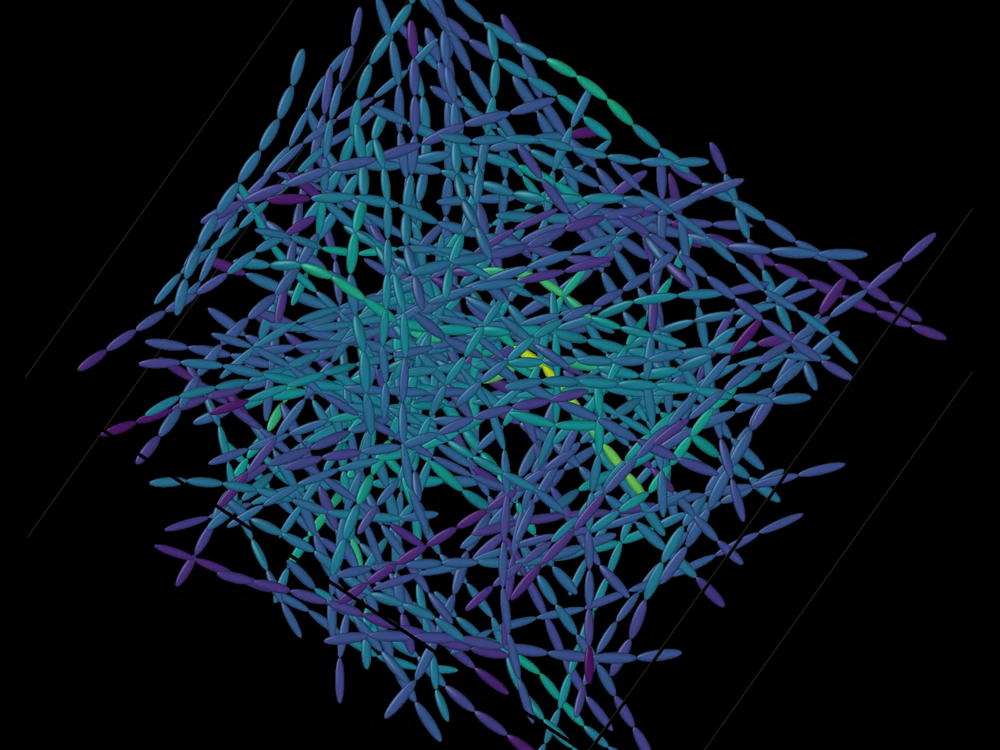

# Biased fiber-box generation

[](../../docs/media/planar-bias.mp4)

*Click the preview to play the planar-layered OVITO rendering.*

This example generates three deterministic 160-fiber populations from the same
seed:

| Output directory | Orientation | Position |
| --- | --- | --- |
| `isotropic_3d` | Uniform in 3D | Uniform |
| `planar_layered` | Within 10 degrees of the XY plane | Four Z layers |
| `aligned_x` | Within 15 degrees of the X axis | Uniform |

Fiber length, radius, and natural curvature amplitude are sampled from bounded
uniform distributions. Every swept fiber is fully contained by the unit cell,
and every fiber carries a minimum bend radius. The same geometric relaxation
then removes overlaps without discarding the sampled manufacturing bias.

The example reports solid volume fraction and the length-weighted second-order
orientation tensor before and after relaxation, saves the assembled reference,
and exports a bonded-sphere DEM model.

```console
cargo run --release -p biased_fiber_box_dem_bpm
cargo run --release -p biased_fiber_box_dem_bpm -- --debug-ovito
cargo run --release -p biased_fiber_box_dem_bpm --bin biased_fiber_stress -- \
  --case planar_layered --fiber-count 800 --cell-capacity 128 --max-iterations 6000
```

The default binary is the teaching example. Its code follows the physical
workflow directly: sample a population, relax it, optionally compact its
layers, characterize it, and export it. The `biased_fiber_stress` companion
binary owns the large-run command-line interface so those controls do not hide
the tutorial's GRASS plugin schedule.

Stress-run controls are `--case`, `--fiber-count`, `--segments-per-fiber`,
`--cell-capacity`, `--max-iterations`, and `--batch-iterations`. The case names
are `isotropic_3d`, `planar_layered`, and `aligned_x`. Capacity overflow and
iteration-limit exits are reported as normal stress-test outcomes rather than
being mistaken for a valid relaxed material.

The planar case also installs the GRASS-controlled layered formation protocol.
Tune it with `--initial-layer-iterations`, `--compaction-steps`,
`--layer-iterations-per-step`, and `--final-layer-spacing-scale`, or disable it
with `--no-layered-formation`. Fiber buffers remain on the GPU across every batch;
only the small target-plane command and scalar convergence buffers cross the
host/device boundary.

Debug mode writes one oriented spherocylinder per centerline segment and colors
fibers by identifier in the generated OVITO viewing recipe. It explicitly
downloads one sparse geometry snapshot every ten GPU iterations, plus the
initial and final configurations. Without `--debug-ovito`, there are no
intermediate geometry readbacks.

Stress-run output is placed under `output/stress/<case>` so it does not
overwrite the tutorial results.

The example always runs CubeCL through WGPU (Metal on supported Apple systems).
Initial geometry and flat topology are uploaded once. A device-side uniform
cell list supplies the contact broad phase; cell construction, exact capsule
contact, stretch, bend-surrogate, boundary, and convergence operations remain
on the device until final geometry is downloaded for characterization and
DEM-BPM export. A fixed cell capacity detects dense-cell overflow and fails
explicitly instead of silently dropping candidate segments.
