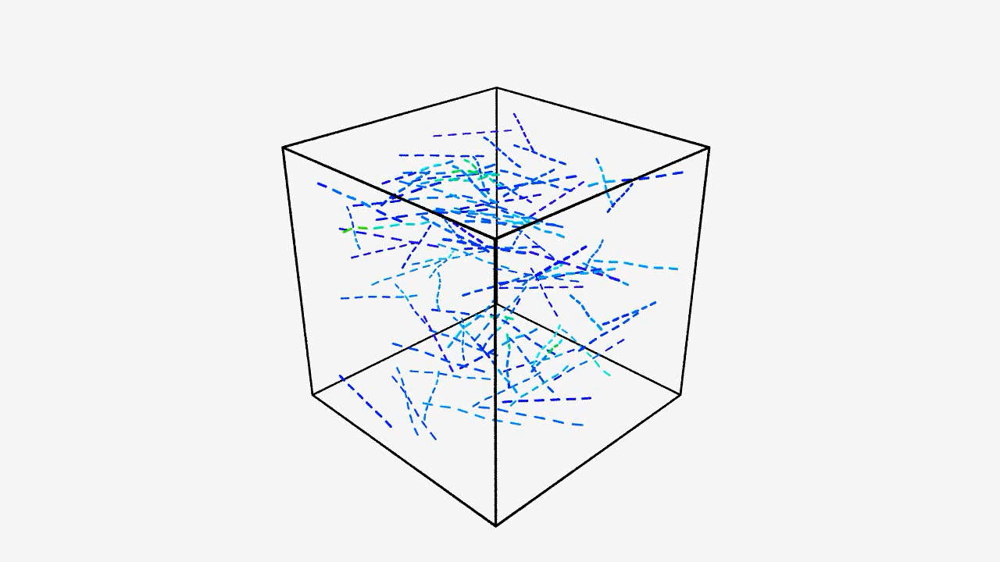

# Fake TPS formation

[](../../docs/media/formation-recipe.mp4)

*Click the preview to play the OVITO rendering.*

This teaching example treats a hypothetical fibrous TPS as the result of a
manufacturing recipe rather than one random draw. It creates:

- 96 nearly planar fibers distributed among six deposition layers;
- 24 approximately through-thickness fibers reserved for later insertion.

The GRASS-controlled recipe is deliberately visible in `src/main.rs`:

1. insert the planar population;
2. relax for 80 GPU iterations;
3. compact the layer targets in four stages (60%, 30%, 16%, and 9% of
   their initial spacing), relaxing after each stage;
4. hold the final targets about one mean fiber diameter apart so contact
   relaxation makes adjacent layers meet rather than merely moving them closer;
5. capture probabilistic planar–planar contact bonds;
6. insert the through-thickness population;
7. keep the compacted layer target active and relax for 160 iterations while
   capturing planar–through-thickness ties every 40 iterations;
8. release the layer targets;
9. move the upper and lower thickness platens inward in adaptive increments
   until the active fibers reach a nominal volume fraction of 1%;
10. release the manufacturing controls and converge normally.

All fibers are allocated when the CubeCL world is created, but a device-side
activity mask makes later populations physically absent until their insertion
command. That gives formation plugins cheap, deterministic topology activation
without repeatedly uploading the fiber world. `formation_step` controls when a
fiber appears; the independent optional `formation_layer` controls which fibers
respond to planar motion. Through-thickness fibers therefore participate in an
insertion step without being tethered to a plane.

`MoveLayers` installs a persistent target rather than applying a single nudge.
The resident GPU world reapplies that target every solver iteration until a
later `MoveLayers` replaces it or the recipe ends. This lets contact separation
and layer compaction work together throughout each relaxation interval.

The final `Compact` operation is a different control: it changes the cell
itself. This example uses thickness-only axis weights, symmetric moving walls,
and a nominal-volume-fraction target. Each cell change is followed by GPU
relaxation; the controller grows or shrinks its next logarithmic-strain
increment from the convergence cost and reports directional penalty pressure,
formation energy, and accumulated boundary work. On the deterministic example
seed, the thickness decreases from 1.0 to about 0.766 cell units.

Run the example and generate its DEM-BPM model:

```console
cargo run --release -p fake_tps_formation
```

Record the staged process as an OVITO-readable trajectory:

```console
cargo run --release -p fake_tps_formation -- --debug-ovito
```

The initial prepacked host assembly is intentionally omitted from the
trajectory. Frames through iteration 400 contain only the 96 planar fibers;
subsequent frames contain all 120 fibers. The generated viewing script is
`output/relaxation_view.py`.

With the OVITO Python package or `ovitos` available, render the trajectory from
a fixed three-quarter camera as a 1280×720 MP4:

```console
python render_movie.py
```

The movie is written to `output/fake_tps_formation.mp4`.

The two junction policies demonstrate independent control over contact gap,
crossing angle, deterministic probability, material pairs, junction-law name,
parameter-set ID, per-fiber-pair multiplicity, anchor spacing, and candidate
capacity. An explicit `CaptureJunctions` operation samples once; a
`RelaxAndCapture` operation has a cadence independent of the GRASS GPU batch
size. Accepted contacts become persistent material-coordinate `FiberAnchor`s
and are exported as inter-fiber DEM-BPM bonds.

This is intentionally a fake material, not a calibrated FiberForm or MERINO
model. The population distributions and formation operations are the extension
points to replace when experimental process data become available.
