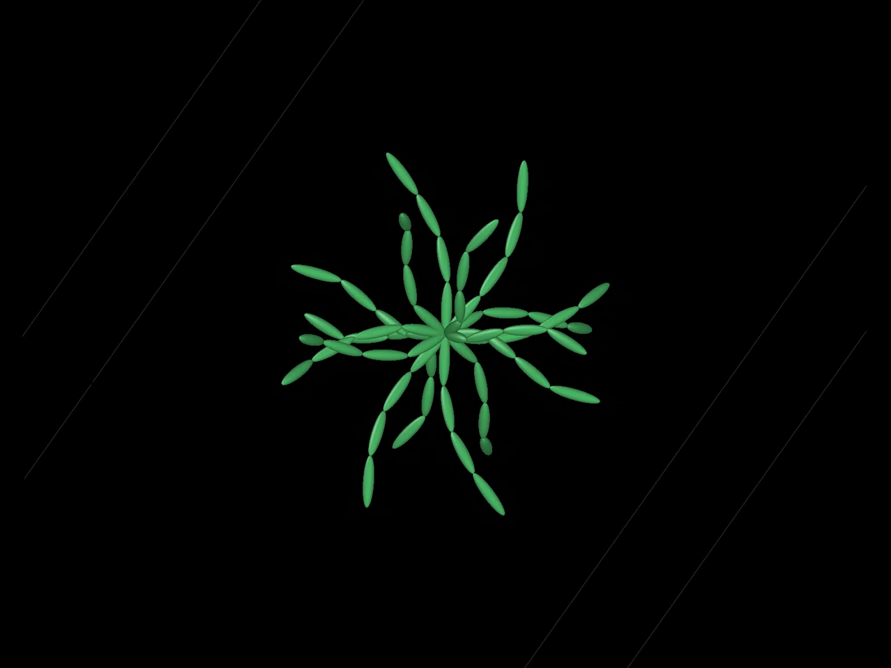

# Multi-segment flexible-fiber relaxation

[](../../docs/media/rest-curvature.mp4)

[Rest-curvature video](../../docs/media/rest-curvature.mp4) ·
[admissible bend-limit video](../../docs/media/bend-limit.mp4)

This example separates the two meanings of fiber shape:

- `intrinsic` is the unloaded shape a fiber mechanically wants;
- `placed` is the shape it currently has in the network;
- `assembled_reference` is an optional snapshot of the network after
  relaxation.

It runs four independent eight-fiber assemblies. Every fiber has a minimum
bend radius of `0.12` cell-length units:

| Output directory | Intrinsic | Initially placed | Meaning |
| --- | --- | --- | --- |
| `straight_intrinsic_straight_placed` | straight | straight | Straight fiber, initially straight |
| `straight_intrinsic_curved_placed` | straight | curved | Bent straight fiber that wants to recover |
| `curved_intrinsic_curved_placed` | curved | matching curve | Naturally curved fiber that wants to retain its curve |
| `straight_intrinsic_overbent_placed` | straight | over-bent curve | Initially violates the bend limit and must be smoothed |

All fibers initially pass through the center of a unit cell. Their endpoints
are free so that contact, stretch, and bending preference—not an artificial
fixture—determine the relaxed shapes. Each converged placed geometry is saved
as its assembled reference and exported as a bonded-sphere DEM model. Contact,
cell-list construction, stretch, rest-shape bending, curvature limiting, and
position updates all execute inside a persistent CubeCL GPU world.
The standard characterization plugin reports maximum curvature and admissible
bend-limit utilization, so the example does not traverse TANGLE's flat
topology and geometry buffers itself.

Run the pipeline:

```console
cargo run -p multisegment_flexible_relaxation_dem_bpm
```

Explicitly download every tenth relaxation step, plus the initial and final
states, as oriented spherocylinders for OVITO:

```console
cargo run -p multisegment_flexible_relaxation_dem_bpm -- --debug-ovito
```

Each case gets its own output subdirectory. The generated
`relaxation_view.py` loads that case's trajectory, selects OVITO's
spherocylinder particle shape, colors capsules by `curvature_ratio`, and can
save a local `relaxation.ovito` session when run by an OVITO Python environment:

```text
curvature_ratio = current curvature / maximum admissible curvature
```

Zero is straight, one is the bend limit, and values above one are violations.
The relaxation stage cannot report convergence unless this ratio is at most
`1 + curvature_ratio_tolerance` and capsule penetration is at most
`penetration_tolerance`. The bend-limit projection distributes motion across
all three points of a turn while assigning zero inverse mass to pinned points.
The dump also contains `natural_curvature`, `current_curvature`, and
`curvature_excess` for inspection or alternate coloring.

Useful first experiments are changing the cases in `shape_cases()`,
`MINIMUM_BEND_RADIUS`, bending stiffness, or the placed chord fraction. Each
changes one mechanically meaningful part of the experiment without changing
the plugin schedule.
